# Active Directory File Shares – Managing Permissions with Security Groups

This project demonstrates how to configure network file shares with role-based access control using Active Directory security groups on Windows Server 2019. Four shared folders were created on the Domain Controller with different permission levels. A standard domain user tested access to each folder from a Windows 11 client, verifying read-only, read/write, and restricted access behaviors. A dedicated security group was then created and granted access to a restricted folder — after adding the user to the group and re-authenticating, access was successfully granted.

This lab simulates how IT administrators manage file share permissions in a real enterprise environment using the principle of least privilege.

---

## Environments and Technologies Used

- Oracle VirtualBox
- Windows Server 2019 (Domain Controller — DC-1)
- Windows 11 Enterprise (Client — Client-1)
- Active Directory Users and Computers (ADUC)
- Windows File Explorer (Network File Sharing)
- Command Prompt (`gpupdate /force`)

---

## Prerequisites

This lab builds on an existing Active Directory environment:

- Domain: `mydomain.com`
- Domain Controller: DC-1 (Windows Server 2019)
- Client machine: Client-1 (Windows 11, domain-joined)
- Admin account: Thomas (Domain Admin)
- Test user: Solomon Yohanis (Domain User)

---

## Step 1 – Create the Shared Folders on DC-1

On DC-1, File Explorer was opened and four folders were created directly on the `C:\` drive by right-clicking on empty space and selecting **New → Folder**.

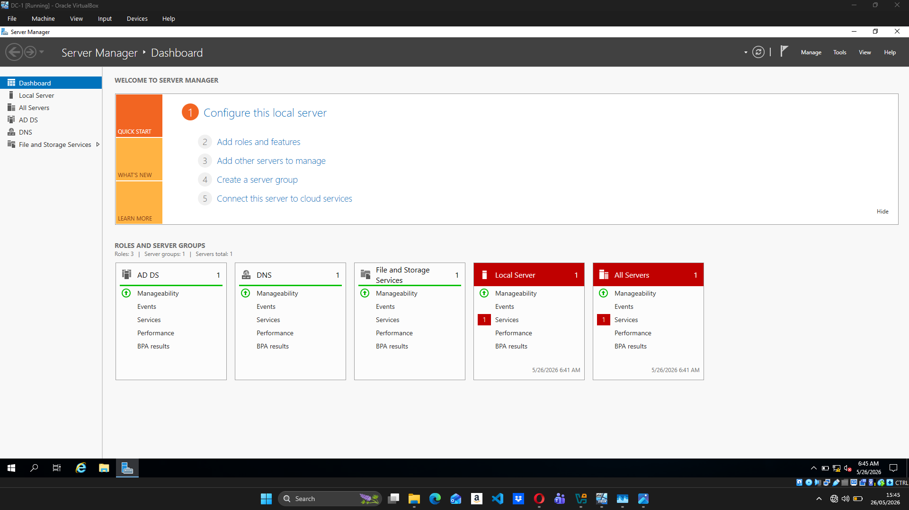

DC-1 Server Manager Dashboard showing the starting state — roles AD DS, DNS, and File and Storage Services are active.

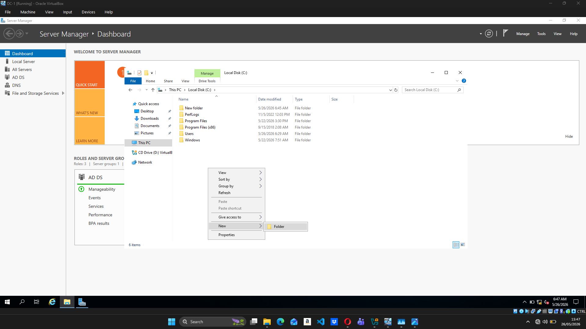

Right-clicking inside C:\ and navigating to New → Folder to begin creating the shared folders.

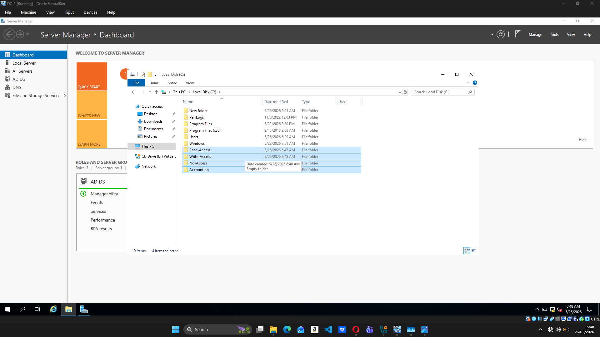

C:\ drive showing all four folders created: Read-Access, Write-Access, No-Access, and Accounting — 4 items selected in the status bar.

---

## Step 2 – Configure Share Permissions

Each folder was right-clicked → **Properties** → **Sharing** tab → **Share...** to open the Network access dialog, where the appropriate group and permission level were assigned.

### Read-Access

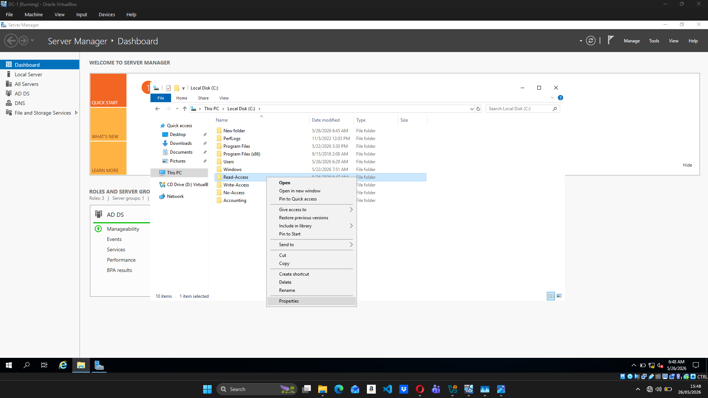

Read-Access folder Properties — General tab confirming the folder was just created (0 bytes, empty, located at C:\).

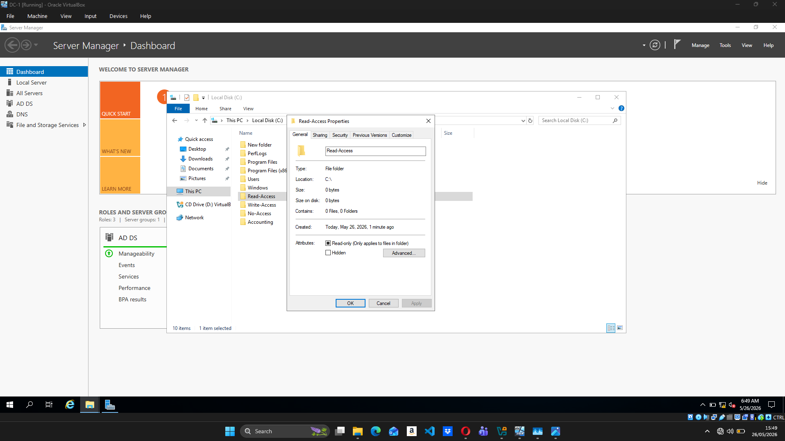

Right-clicking Read-Access and selecting Properties to begin the sharing configuration.

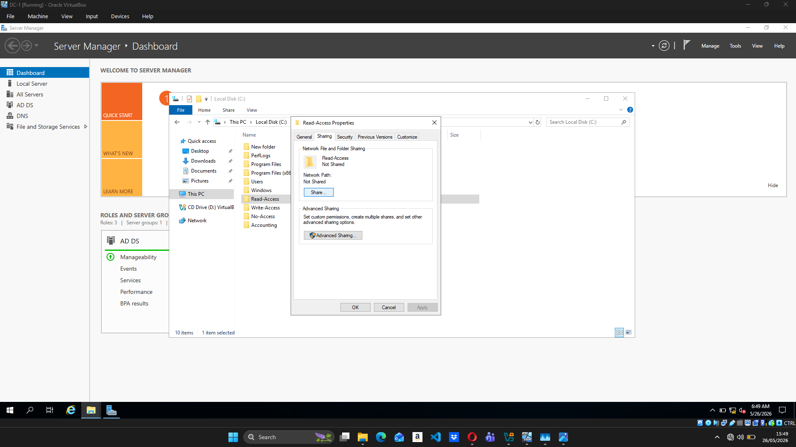

Read-Access Properties — Sharing tab showing the folder is currently Not Shared. Clicking Share... to proceed.

Network access dialog opened for Read-Access — only Thomas (Owner) is listed. Ready to add Domain Users.

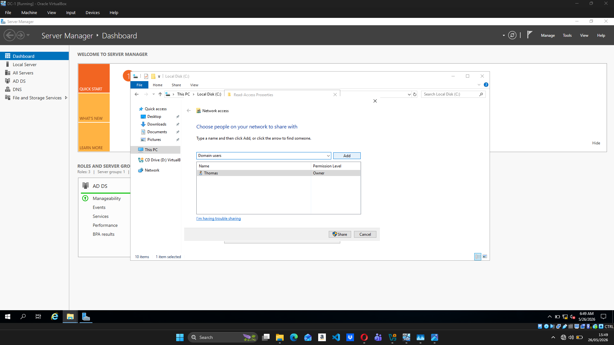

"Domain users" typed into the search field — clicking Add to grant all domain users access.

Domain Users added to Read-Access with Read permission only — Thomas remains as Owner.

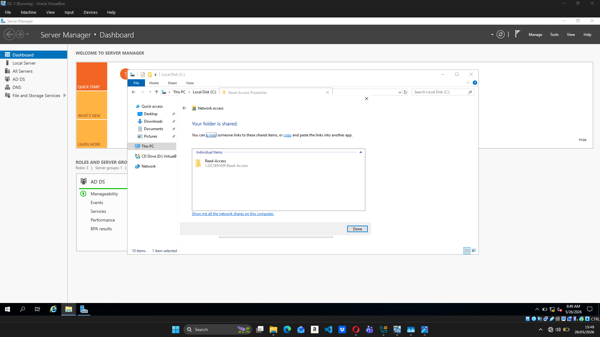

"Your folder is shared" confirmation — network path confirmed as \\DCSERVER\Read-Access.

---

### Write-Access

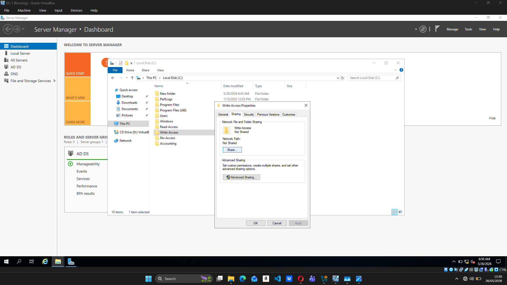

Write-Access Properties — Sharing tab showing the folder is currently Not Shared. Clicking Share... to proceed.

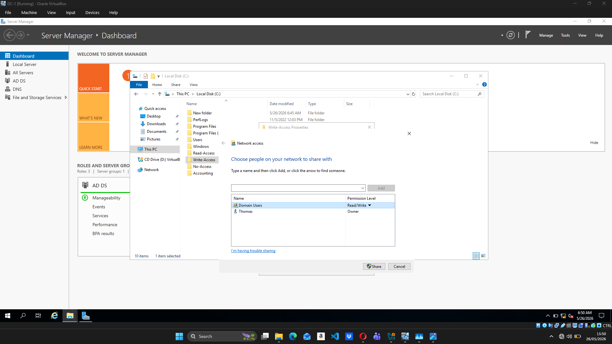

Domain Users added to Write-Access with Read/Write permission — allows creating, editing, and deleting files.

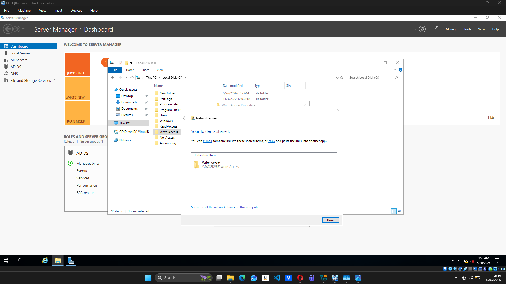

"Your folder is shared" confirmation — network path confirmed as \\DCSERVER\Write-Access.

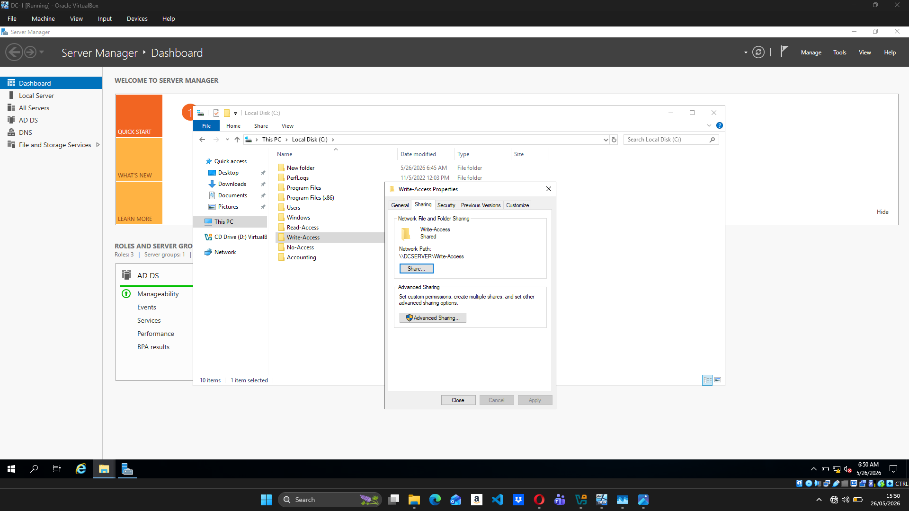

Write-Access Properties Sharing tab now shows Shared status with network path \\DCSERVER\Write-Access.

---

### No-Access

No-Access Properties — Sharing tab showing the folder is currently Not Shared. Clicking Share... to proceed.

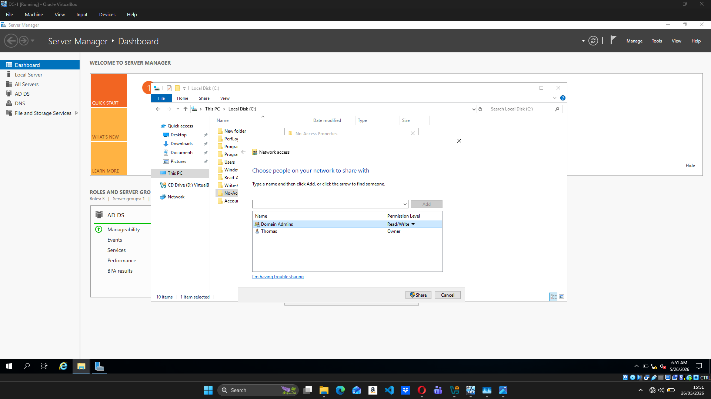

Domain Admins added to No-Access with Read/Write permission — standard Domain Users will be completely blocked.

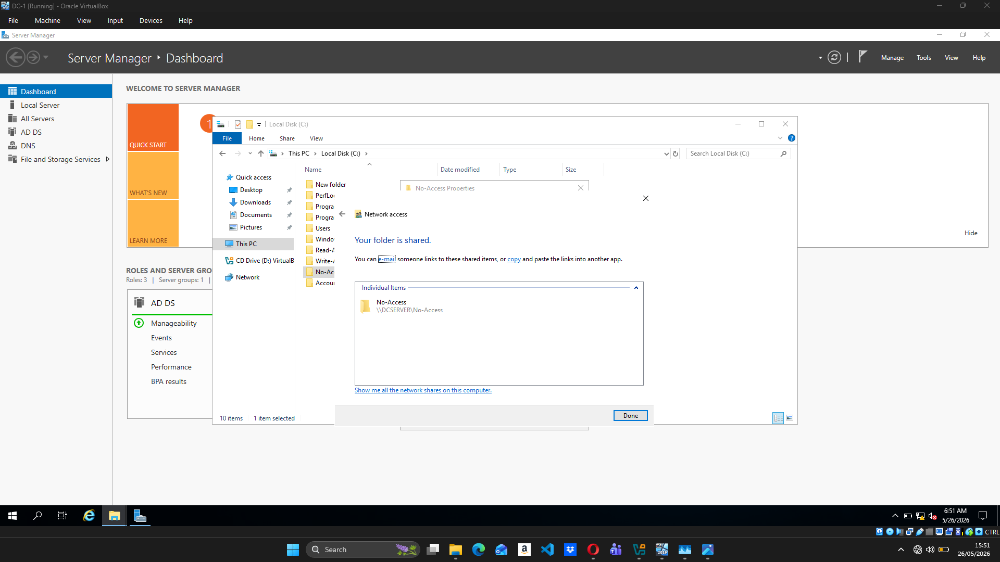

"Your folder is shared" confirmation — network path confirmed as \\DCSERVER\No-Access.

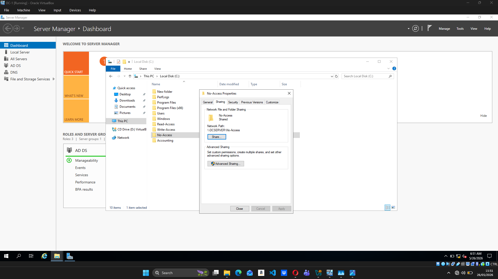

No-Access Properties Sharing tab now shows Shared status with network path \\DCSERVER\No-Access.

---

## Step 3 – Access the Shares from Client-1

On Client-1, logged in as domain user Solomon Yohanis. In File Explorer, `\\dcserver` was typed into the address bar to browse the Domain Controller's available network shares.

Client-1 File Explorer on Windows 11 — right-clicking Network in the left panel.

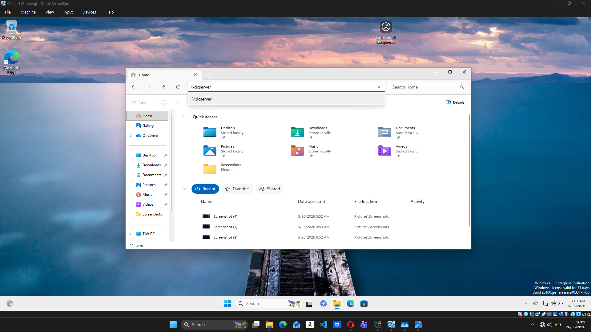

Typing \\dcserver into the address bar on Client-1 — autocomplete suggestion appears.

Client-1 successfully browsing \\dcserver — all shared folders visible: NETLOGON, No-Access, Read-Access, SYSVOL, and Write-Access.

---

## Step 4 – Test Permissions as a Standard Domain User

With Solomon Yohanis logged in as a standard domain user on Client-1, access to each shared folder was tested to verify the permissions were enforced correctly.

### Read-Access

Standard domain user successfully opens the Read-Access folder — folder is accessible. 

Attempting to create a file inside Read-Access returns "Destination Folder Access Denied — You need permission to perform this action" — read-only enforcement confirmed. 

---

### Write-Access

Standard domain user successfully opens the Write-Access folder — folder is accessible. 

Text file named "permission granted" successfully created inside Write-Access — Read/Write permission confirmed. 

---

### No-Access

No-Access folder selected in \\dcserver — about to attempt access as a standard domain user.

Network Error: "Windows cannot access \\dcserver\No-Access — You do not have permission to access this folder." — Domain Admins only restriction confirmed. 

---

## Step 5 – Create the ACCOUNTANTS Security Group

Back on DC-1, a dedicated security group was created in Active Directory Users and Computers to control access to the Accounting share. Rather than granting permissions to individual users, a group is used so access can be managed simply by adding or removing members.

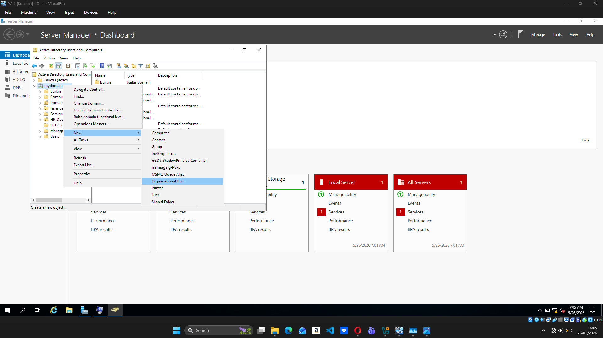

Active Directory Users and Computers — right-clicking the domain root → New → Organizational Unit to create a container for the security group.

New Object — Organizational Unit dialog with "_GROUPS" entered as the name. The underscore prefix keeps it sorted at the top of the AD tree for easy navigation.

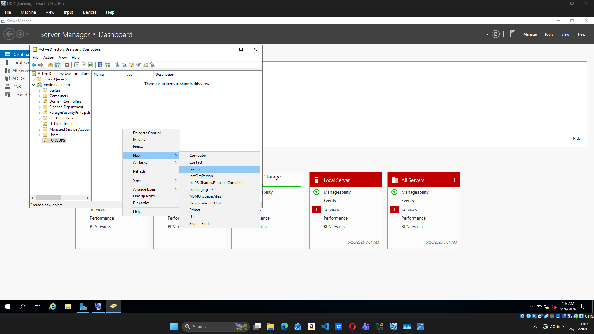

Inside the _GROUPS OU — right-clicking → New → Group to create the ACCOUNTANTS security group.

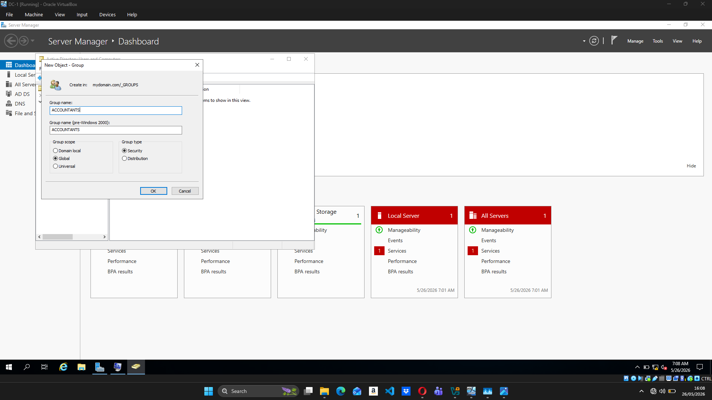

New Object — Group dialog: Group name set to "ACCOUNTANTS", Group scope set to Global, Group type set to Security. Created in mydomain.com/_GROUPS.

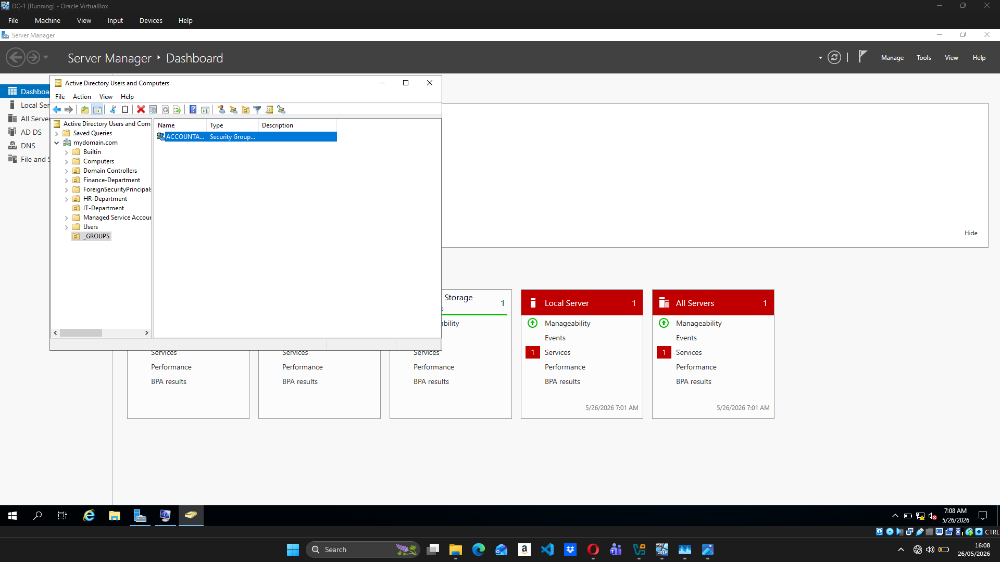

ACCOUNTANTS security group successfully created and visible in the _GROUPS OU — listed as Security Group type.

---

## Step 6 – Share the Accounting Folder with the ACCOUNTANTS Group

With the security group created, the Accounting folder was shared and the ACCOUNTANTS group was granted Read/Write access.

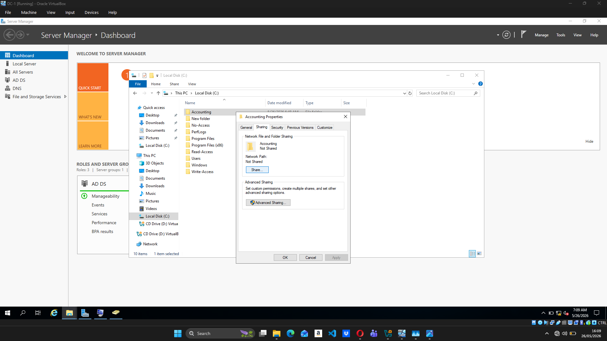

Accounting folder Properties — Sharing tab showing the folder is currently Not Shared. Clicking Share... to proceed.

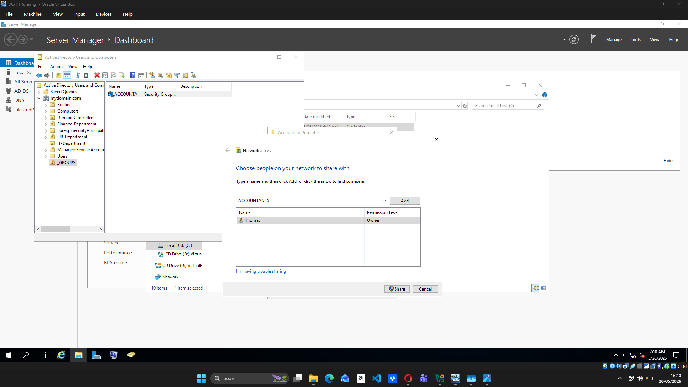

"ACCOUNTANTS" typed into the Network access search field — clicking Add to grant the security group access.

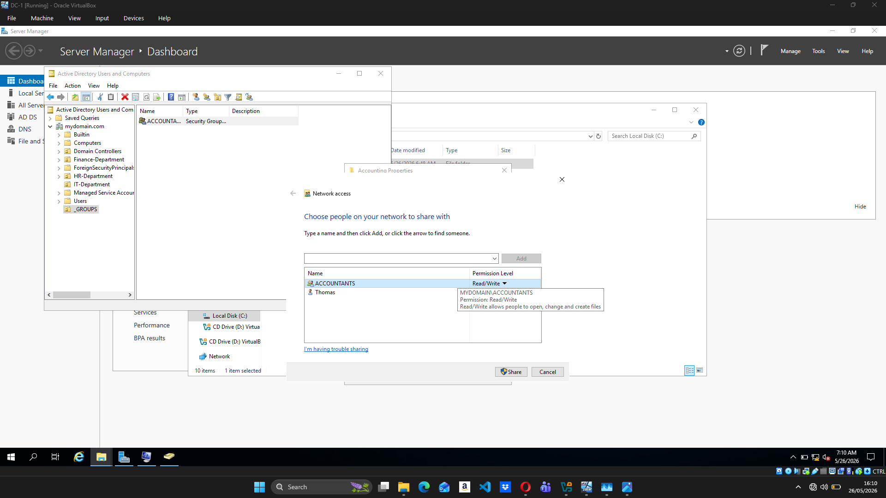

ACCOUNTANTS group added with Read/Write permission — tooltip confirms MYDOMAIN\ACCOUNTANTS with Read/Write access, allowing users to open, change, and create files.

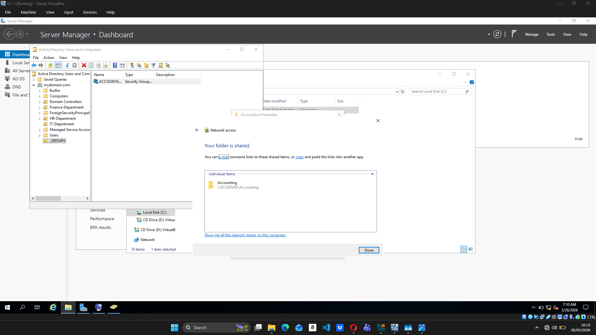

"Your folder is shared" confirmation — network path confirmed as \\DCSERVER\Accounting.

---

## Step 7 – Test Accounting Access Before Adding User to Group

Before adding Solomon Yohanis to the ACCOUNTANTS group, access to the Accounting share was tested from Client-1 to confirm the restriction was in effect.

Network Error: "Windows cannot access \\dcserver\Accounting — You do not have permission to access this folder." — confirmed blocked for users outside the ACCOUNTANTS group. 

---

## Step 8 – Add Solomon Yohanis to the ACCOUNTANTS Group

Back on DC-1, Solomon Yohanis was added to the ACCOUNTANTS security group through Active Directory Users and Computers.

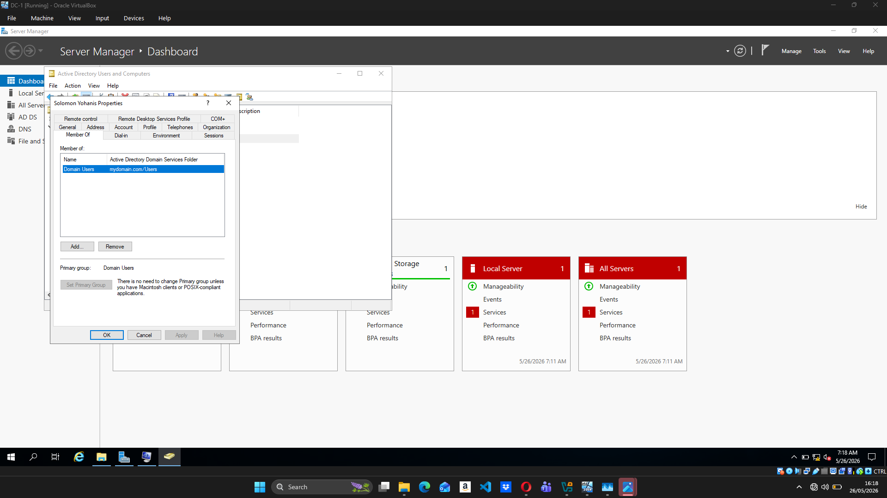

Solomon Yohanis Properties — Member Of tab showing current group membership: Domain Users only (mydomain.com/Users).

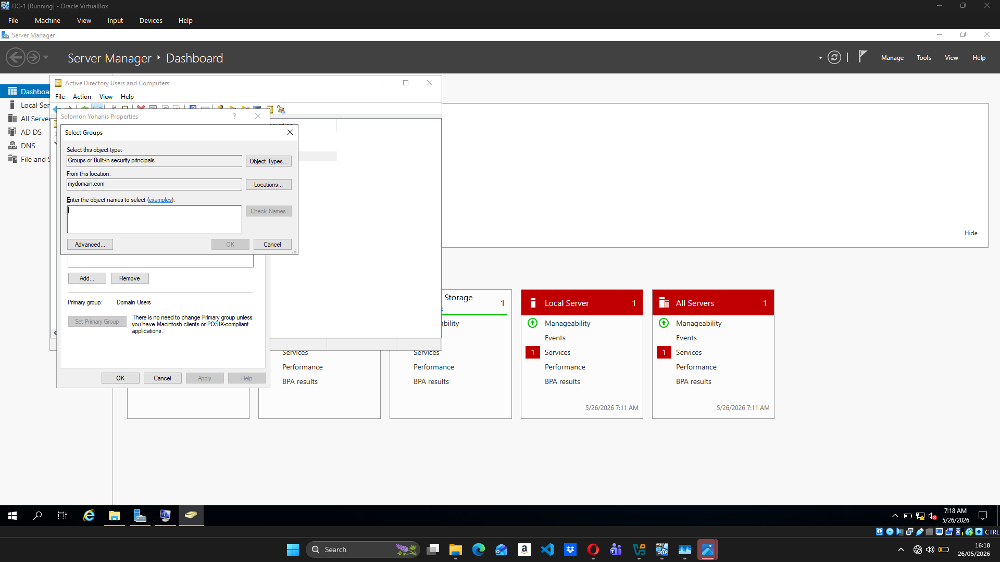

Select Groups dialog opened after clicking Add — ready to search for the ACCOUNTANTS group in mydomain.com.

"ACCOUNTANTS" typed into the object name field — clicking OK to confirm and add the group membership.

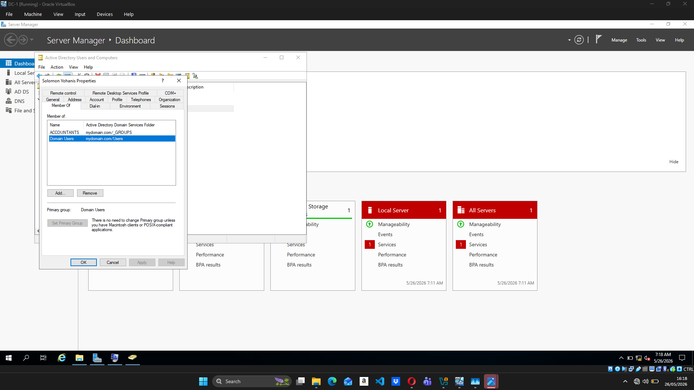

Solomon Yohanis Member Of tab now shows two groups: ACCOUNTANTS (mydomain.com/_GROUPS) and Domain Users (mydomain.com/Users) — group membership successfully updated. 

---

## Step 9 – Verify Accounting Access

Client-1 browsing \\dcserver and selecting Accounting folder.

Solomon Yohanis successfully opens the Accounting folder — access granted as a member of the ACCOUNTANTS security group. 

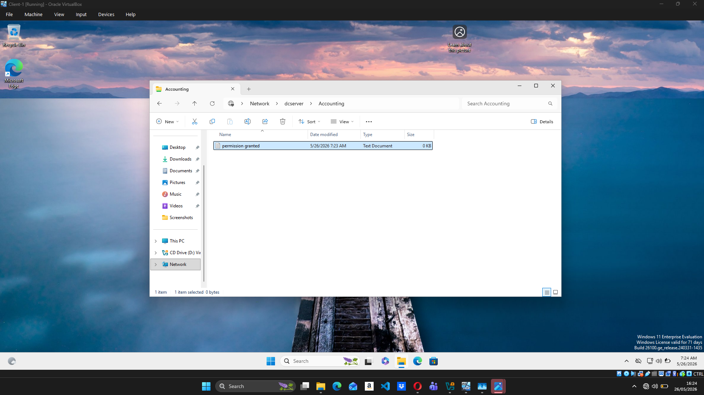

Text file named "permission granted" successfully created inside the Accounting folder — Read/Write permission via group membership confirmed. 

---

## Conclusion
This lab successfully demonstrated how to configure and manage network file share permissions using Active Directory security groups on Windows Server 2019. By creating four shared folders with different permission levels and testing access from a domain-joined Windows 11 client, the lab confirmed that share permissions were enforced correctly for each group.
The most important concept demonstrated is role-based access control through security groups. Rather than assigning permissions to individual users, access to the Accounting share was controlled entirely through the ACCOUNTANTS group — meaning access can be granted or revoked simply by managing group membership, with no changes to the share configuration required. This is how permissions are managed in real enterprise environments and is a fundamental skill for IT administrators and help desk professionals.
